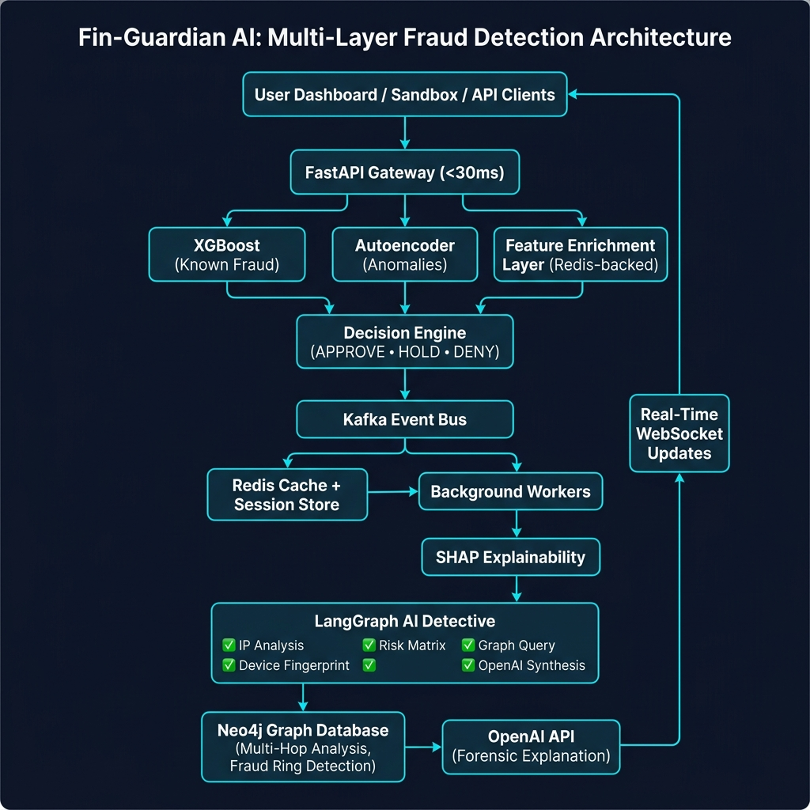
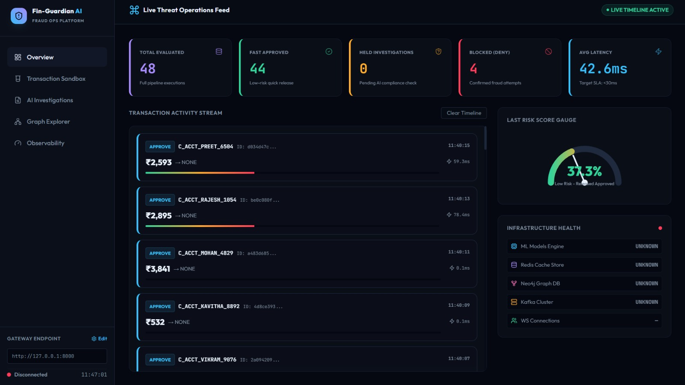
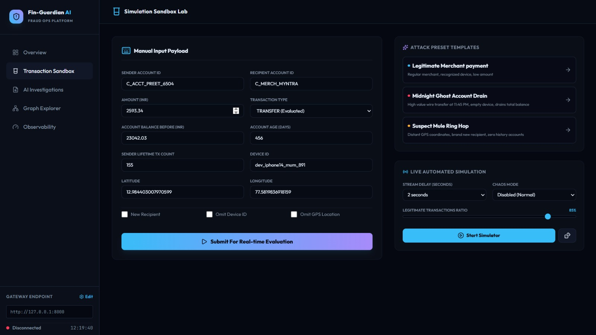
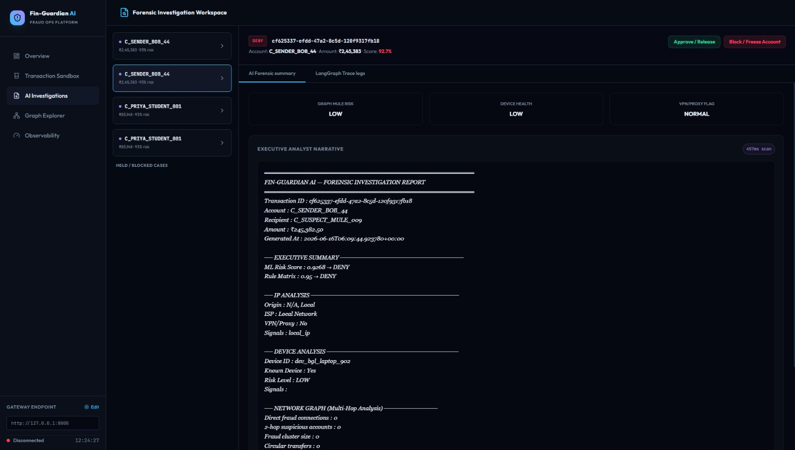
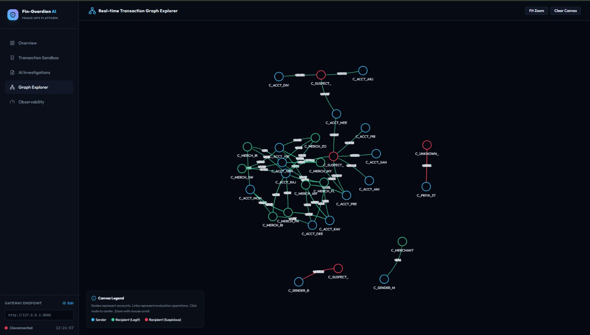

# 🛡️ Fin-Guardian AI

<h3 align="center">
Intelligent Fraud Detection & Investigation Platform
</h3>

<p align="center">
Real-time AI-powered fraud detection system inspired by modern banking fraud workflows.
</p>

<p align="center">


</p>

---

# 🚀 Overview

Fin-Guardian AI is an end-to-end fraud detection and investigation platform designed to simulate modern financial fraud operations.

The platform combines:

- ⚡ Real-time machine learning inference
- 🧠 Hybrid anomaly detection
- 📈 Explainable AI (SHAP)
- 🕸 Graph intelligence (Neo4j)
- 🤖 AI-powered investigations
- 📡 Event-driven architecture
- 🔴 Live dashboards and WebSocket updates

---

# 🌟 Highlights

- ⚡ Sub-30ms fraud inference
- 🧠 XGBoost + Autoencoder hybrid detection
- 📈 SHAP explainability
- 🕸 Neo4j graph intelligence
- 🤖 LangGraph AI Detective
- 📡 Kafka + Redis architecture
- 🔴 Real-time dashboard updates
- 🔍 AI-generated forensic explanations

---

# 🏗 System Architecture

Fin-Guardian AI follows a multi-layer architecture inspired by modern fraud prevention systems.



---

# 📊 Dashboard Overview

Real-time monitoring dashboard showing transaction activity, system health, latency, and risk metrics.



---

# 🧪 Transaction Sandbox

Interactive sandbox for manually simulating banking transactions.

Users can test both legitimate and suspicious scenarios.



---

# 🤖 AI Investigation Workspace

Displays AI-generated forensic reports and investigation summaries for suspicious transactions.



---

# 🕸 Graph Explorer (Neo4j)

Visual fraud network used for multi-hop relationship analysis and money mule detection.



---

# ✨ Core Features

## ⚡ Real-Time Risk Scoring

Transactions are classified into:

- APPROVE
- HOLD
- DENY

---

## 🧠 Hybrid Fraud Detection Engine

Combines:

### XGBoost

Detects known fraud patterns.

### PyTorch Autoencoder

Detects previously unseen anomalies.

---

## 📈 Explainable AI

SHAP values provide:

- Feature importance
- Transparent predictions
- Compliance-friendly explanations

---

## 🕸 Graph Intelligence

Neo4j graph analysis enables:

- Multi-hop relationship discovery
- Fraud ring detection
- Money mule identification

---

## 🤖 LangGraph AI Detective

Autonomous investigation pipeline capable of:

- IP analysis
- Device fingerprint analysis
- Risk matrix evaluation
- Graph queries
- OpenAI-powered forensic reports

---

## 📡 Event-Driven Architecture

Supports:

- Kafka messaging
- Redis caching
- Background workers
- WebSocket updates

---

# 🏗 Multi-Layer Architecture

## Layer 1 — Hot Path (<30ms)

- Feature engineering
- XGBoost inference
- Autoencoder anomaly detection
- Instant APPROVE / HOLD / DENY decisions

---

## Layer 2 — Event Pipeline

- Kafka events
- Redis cache
- Background processing

---

## Layer 3 — Deep Investigation

- LangGraph AI detective
- SHAP explainability
- Neo4j graph intelligence
- OpenAI explanations

---

## Layer 4 — Dashboard

- Real-time monitoring
- WebSocket updates
- Interactive sandbox

---

# 🛠 Tech Stack

| Layer | Technology |
|---------|------------|
| Backend | FastAPI |
| ML Model | XGBoost |
| Anomaly Detection | PyTorch Autoencoder |
| Explainability | SHAP |
| Event Bus | Kafka |
| Cache | Redis |
| Graph Database | Neo4j |
| AI Agent | LangGraph |
| LLM | OpenAI API |
| Realtime | WebSockets |
| Testing | Pytest |
| Experimentation | Jupyter |

---

# 📂 Project Structure

```text
Fin-Guardian-AI
│
├── app/
├── workers/
├── artifacts/
├── dashboard/
├── graph/
├── tests/
├── docs/
│   └── screenshots/
├── Notebooks/
├── docker-compose.yml
└── requirements.txt
```

---

# ⚡ Quick Start

## Clone Repository

```bash
git clone https://github.com/RohanKaushik032/Fin-Guardian-AI.git

cd Fin-Guardian-AI
```

---

## Create Environment

```bash
python -m venv myenv

myenv\Scripts\activate
```

---

## Install Dependencies

```bash
pip install -r requirements.txt
```

---

## Start Infrastructure

```bash
docker-compose up -d
```

Services started:

- Kafka
- Redis
- Neo4j

---

## Run FastAPI

```bash
python -m uvicorn app.main:app --reload
```

Open:

```text
http://localhost:8000/docs
```

---

# 🧪 Example Transaction

```json
{
  "account_id": "C_USER_789",
  "recipient_id": "C_NEW_RECIPIENT_456",
  "amount": 12000,
  "transaction_type": "TRANSFER"
}
```

Example response:

```json
{
  "verdict": "HOLD",
  "fraud_score": 0.87
}
```

---

# 🔍 AI Investigation Pipeline

### IP Analysis

- VPN detection
- Geolocation checks

### Device Fingerprinting

- Missing device checks
- Emulator detection

### Graph Analysis

- Neo4j queries
- Multi-hop relationship analysis

### Rule Engine

- Risk matrices
- Fraud heuristics

### OpenAI Synthesis

- Human-readable forensic reports

---

# 📚 Learning Resources

Documentation:

- PROJECT_SETUP.md
- SETUP.md
- IMPLEMENTATION_STATUS.md
- docs/LEARNING_CURRICULUM.md

Jupyter Notebooks:

- Data Understanding
- EDA & Insights
- Feature Engineering
- XGBoost Training
- Autoencoder Training
- SHAP Explainability

---

# 🧪 Testing

Run:

```bash
pytest
```

---

# 🚧 Roadmap

- [ ] React + Vite frontend
- [ ] Automatic transaction simulator
- [ ] Interactive graph visualization
- [ ] SHAP dashboard
- [ ] Prometheus monitoring
- [ ] OpenTelemetry tracing
- [ ] Docker deployment
- [ ] Kubernetes support

---

# 👨‍💻 Author

## Rohan Kaushik

AI Engineer • Machine Learning • MLOps • Graph Intelligence

### GitHub

https://github.com/RohanKaushik032

### LinkedIn

https://www.linkedin.com/in/rohankaushik32/

---

# ⭐ Support

If you found this project interesting, consider giving the repository a ⭐.

